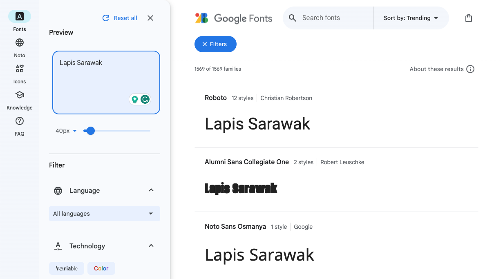
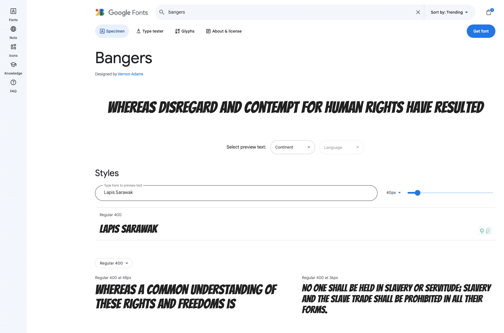
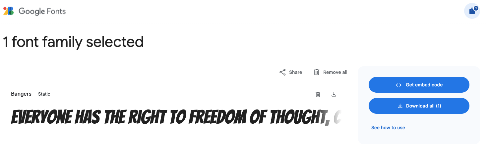
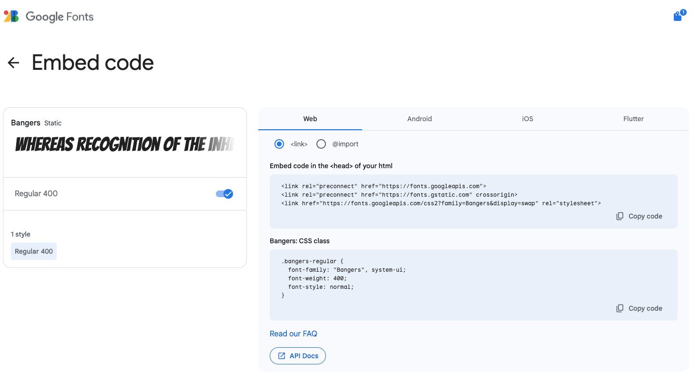
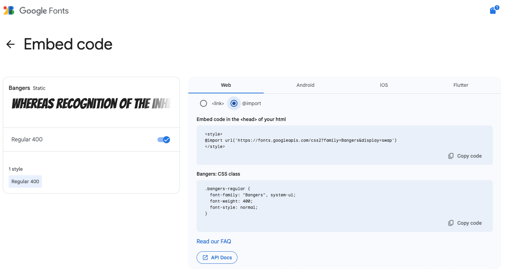

Google has a free online font library with over 1600 fonts to choose from. The site allows you to browse different fonts using your own sample text to help you find the right font. Google Fonts then gives you the **HTML** and **CSS** that you need to **link** or **import** the font into your website. 

### Find a font

Open [fonts.google.com](https://fonts.google.com/){:target="_blank"}.

Type some sample text in the **Preview** box.

**Notice** that the examples show your sample text. You can see how your words will look in all of the fonts available. 

There are many different search filters to use. You can search by language, or different font properties.

Scroll down until you find a font you like. If you know the name of the font you want to use, type it in the main search box. 

**Notice** that you can now see an example of the Bangers font that has been applied to the sample text. 

### Choose your font size 

This example shows 40px.

### Get the embed code

Click the 'Get font' button at the top right.

You will see your selected fonts.

Click the 'Get embed code' button.

You can either use the `<link>` method or the `<import>` method.

### Link method

Copy and paste the HTML code inside the `<head>` tags in your HTML document.

--- code ---
---
language: html
filename: 
line_numbers: 
line_number_start: 
line_highlights: 2-4
---
  <!-- Import fonts from Google -->
  <link rel="preconnect" href="https://fonts.googleapis.com">
  <link rel="preconnect" href="https://fonts.gstatic.com" crossorigin>
  <link href="https://fonts.googleapis.com/css2?family=Bangers&display=swap" rel="stylesheet">

--- /code ---

You need to add in the correct CSS so that the web browser knows when to use this font. 

Go to your `default.css` file and find the font variables (it may also be the file containing the colour palette you have chosen, for example `fiesta.css`). 

Add (or replace) the code for your chosen font. In our example, we use `Bangers, cursive;`.

--- code ---
---
language: css
filename: default.css
line_numbers: true
line_number_start: 15
line_highlights: 16-18
---
  --body-font: 1.1rem Verdana, sans-serif;
  --header-font: lighter 3rem 'Bangers', cursive;
  --title-font: lighter 2rem 'Bangers', cursive;
  --quote-font: lighter 1.5rem 'Bangers', cursive;

--- /code ---

### Import method

Open `style.css`.

Copy and paste the import code at the top.

--- code ---
---
language: css
filename: style.css
line_numbers: 
line_number_start: 
line_highlights:
---

@import url('https://fonts.googleapis.com/css2?family=Bangers&display=swap')

--- /code ---

Open `default.css` and find the font variables (it may also be the file containing the colour palette you have chosen, for example `fiesta.css`). 

Add (or replace) the code for your chosen font. In our example, we use `Bangers, cursive;`.

--- code ---
---
language: css
filename: default.css
line_numbers: true
line_number_start: 15
line_highlights: 16-18
---
  --body-font: 1.1rem Verdana, sans-serif;
  --header-font: lighter 3rem 'Bangers', cursive;
  --title-font: lighter 2rem 'Bangers', cursive;
  --quote-font: lighter 1.5rem 'Bangers', cursive;

--- /code ---